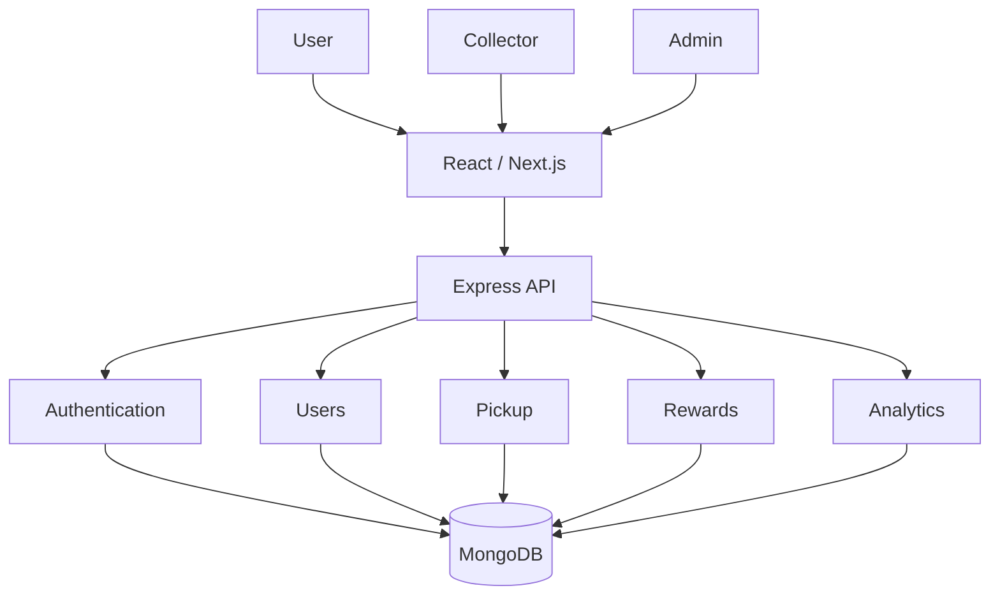
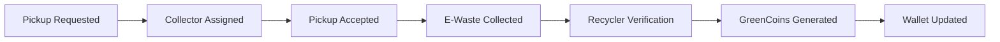
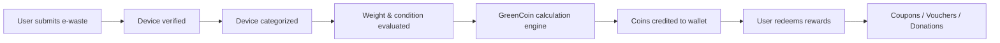
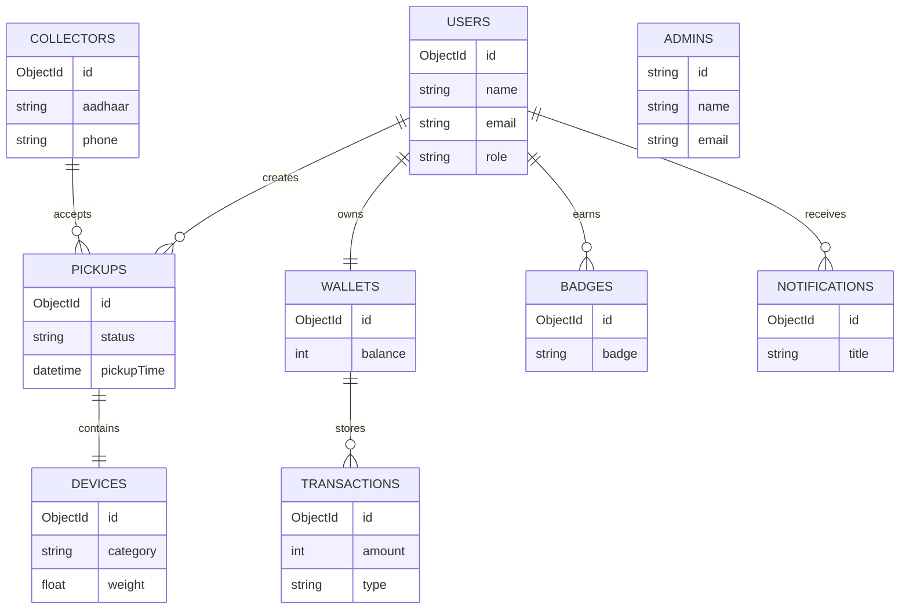

# GreenCoin

### Rewarding Sustainability Through Smart E-Waste Management

*A modern platform connecting citizens, collectors and recyclers through a gamified reward ecosystem.*


</p>

---

# 🌍 Vision

GreenCoin transforms e-waste recycling into an engaging, rewarding and measurable experience.

Instead of operating as a recycling company, GreenCoin serves as the digital infrastructure connecting every stakeholder within the recycling ecosystem.

```
Citizen
    │
    ▼
GreenCoin Platform
    │
    ▼
Verified Collector
    │
    ▼
Authorized Recycler
    │
    ▼
Reward Distribution
```

---

# ✨ Features

-  Authentication & Role Management
-  User Dashboard
-  Collector Portal
-  Pickup Lifecycle
-  GreenCoin Wallet
-  Gamification Engine
-  Analytics Dashboard
-  Admin Panel
-  Notification System

---

# 🏛 High Level Architecture

```text
                    React / Next.js
                           │
        ┌──────────────────┼──────────────────┐
        │                  │                  │
 User Portal      Collector Portal      Admin Panel
        │                  │                  │
        └──────────────────┼──────────────────┘
                           │
                 REST API (Express.js)
                           │
         ┌──────────┬──────────┬──────────┬──────────┐
         │          │          │          │          │
 Authentication   Users    Rewards    Pickup   Analytics
                           │
                     MongoDB Atlas
```

---

# 🏗 System Architecture



---

# 🚚 Pickup Workflow



---

## 🎮 Reward Workflow


---

# 🧩 Modules

## Authentication

- Login
- Register
- JWT
- RBAC

---

## User

- Dashboard
- Wallet
- Pickup History
- Rewards

---

## Collector

- Pickup Requests
- Route
- Earnings
- Status

---

## Rewards

- Coin Engine
- Wallet
- Redemption

---

## Gamification

- Badges
- Streaks
- Levels
- Leaderboard

---

## Admin

- User Management
- Collector Verification
- Analytics
- Rewards

---

## Analytics

- Carbon Saved
- Total Pickups
- Active Users
- Coins Distributed

---

# 🗄 Database Design



---

# 📂 Repository Structure

```
greencoin/

frontend/
backend/

docs/
assets/

database/

api/

.github/

README.md
```

---

# 🚀 Tech Stack

| Layer | Technology |
|--------|------------|
| Frontend | React / Next.js |
| Backend | Node.js |
| Framework | Express.js |
| Database | MongoDB |
| Auth | JWT |
| API | REST |
| Styling | TailwindCSS |
| Deployment | Docker + Vercel + Render |

---

# 🔄 Git Workflow

```text
Fork

↓

Feature Branch

↓

Commit

↓

Pull Request

↓

Review

↓

Merge
```

---


# 📅 Development Roadmap

- [x] Planning
- [ ] Authentication
- [ ] User Dashboard
- [ ] Collector Dashboard
- [ ] Pickup Module
- [ ] Wallet
- [ ] Gamification
- [ ] Analytics
- [ ] Admin Panel
- [ ] Deployment

---

# 🌱 Future Scope

- AI Device Recognition
- QR Verification
- CSR Dashboard
- Blockchain Green Credits
- Carbon Credit Marketplace
- Payment Gateway
- Route Optimization
- AI Chat Assistant

---

# 🤝 Contributing

1. Fork the repository

2. Create a feature branch

3. Commit your changes

4. Push to your fork

5. Open a Pull Request

6. Attach a demo video

---

<p align="center">

Made with ♻ by SmartNerve

</p>
